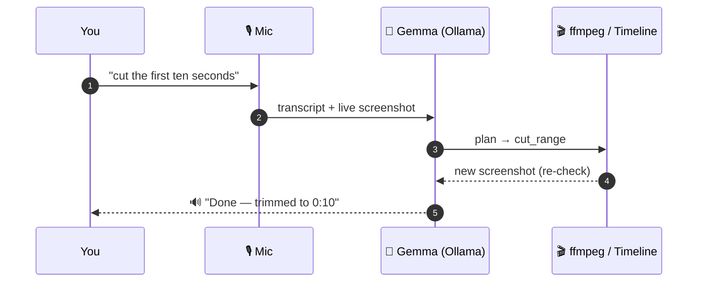

<div align="center">


[](https://git.io/typing-svg)


[](https://voed1.vercel.app/)


</div>

You talk, it edits. Hold the mic, say "cut the first ten seconds" or "remove all the silences," and Voed actually does it — no timeline dragging, no keyboard shortcuts to memorize. Everything runs on your own machine. No cloud, no API keys, no internet required.

Under the hood, a multimodal model *looks at your screen*, figures out what you mean, runs the edit with real ffmpeg calls, checks the result against what you asked for, and tells you it's done. Out loud.

We built this for the Multimodal Track and walked away with 1st place.

## Why this isn't just "Whisper + ffmpeg"

Lots of voice-to-action demos fake the "AI actually did something" part. Ours doesn't. Every command has to clear four bars or it doesn't count:

1. **You actually said it out loud** — real mic input, real STT.
2. **The model actually sees the screen** — a live screenshot goes into the planner every time, not just the transcript.
3. **A real action happens on disk** — ffmpeg re-renders the file, the timeline updates. Not a mocked state change.
4. **You get proof it worked** — spoken confirmation + the UI reflecting the new state, verified by a second screenshot pass.

That loop — plan → act → re-check the screen → confirm — is the whole point of the project.

<div align="center">



</div>

## What's running under the hood

| Piece | Tool |
|---|---|
| Vision + planning | Gemma (multimodal) via **Ollama** |
| Speech-to-text | **faster-whisper** (small) |
| Text-to-speech | **Piper** |
| Video processing | **ffmpeg / ffprobe** |
| Backend | **FastAPI** |
| Frontend | **React + Vite + TypeScript + Tailwind** |
| Storage | **SQLite** (SQLAlchemy) |

### Model

We default to `gemma4:12b` (Q4 quant, ~7.5 GB, ships with a vision projector so it can actually read the editor screen). Swap in something lighter for dev work:

```bash
ollama pull gemma4:12b          # first run only, ~7.5 GB
VOICECUT_MODEL=gemma3:4b ./start.sh   # lighter model for local dev
```

Whichever tag is active shows up on the health screen and gets logged on every planner/verifier call — no guessing what model made a given edit.

## Getting it running

You'll need [ffmpeg](https://ffmpeg.org/download.html), [Ollama](https://ollama.com) running locally, **Python 3.10** (not 3.11+ — `piper-tts` won't install on newer Pythons), and Node 18+.

```bash
# Windows (PowerShell)
powershell -ExecutionPolicy Bypass -File .\start.ps1

# macOS / Linux / Git-Bash / WSL
./start.sh
```

One command. It checks your dependencies, pulls the model if it's missing, installs both the backend and frontend, spins up both servers, and prints the LAN URL. Open it in **Chrome** — works across any machine on your network, not just localhost.

## Your data never leaves your machine

- **In:** your mic audio and whatever video you upload.
- **Processed:** entirely locally — Whisper for STT, Gemma via Ollama for planning/vision/verification, Piper for TTS, ffmpeg for rendering.
- **Stored:** account and project metadata in a local SQLite file; your videos live on local disk under `storage/`.
- **Sent out to the internet:** nothing. No cloud APIs, no keys, no telemetry. Kill your wifi and it still works — the only traffic is to your local Ollama daemon and, optionally, over your LAN so teammates or judges can open it from another machine.

## How it's wired together

```
              ┌─────────────────────────── Browser (Chrome) ───────────────────────────┐
              │  MicButton ──hold──> MediaRecorder ──webm──> /stt                        │
              │  Editor (Timeline + VideoPreview + AgentPanel)                           │
              │  screenshot.ts ──PNG of live editor──> agent loop                        │
              └───────────────▲───────────────────────────────────┬─────────────────────┘
                              │ WebSocket (agent events, per-step) │ HTTP (auth, upload, stt, tts)
              ┌───────────────┴───────────────────────────────────▼─────────────────────┐
              │ FastAPI backend                                                          │
              │   auth · upload(ffprobe) · transcribe(whisper) · stt · tts(piper)        │
              │   agent loop:  plan ─> act(edit engine / ffmpeg) ─> verify               │
              │        planner  ──screenshot+goal+state──>  Gemma (Ollama)               │
              │        verifier ──screenshot+expected──>    Gemma (Ollama)               │
              │   SQLite (users, projects, clips, edit versions, agent runs/steps)       │
              │   storage/ (originals, proxies, rendered edit versions)                  │
              └──────────────────────────────────────────────────────────────────────────┘
```

## Where we landed


- [x] M1 — scaffold, health checks, FastAPI + Vite wiring
- [x] M2 — auth + dashboard + upload
- [x] M3 — editor page (static)
- [x] M4 — STT + mic + TTS ack
- [x] M5 — screenshot capture + planner
- [x] M6 — edit engine trim/cut_range (**end-to-end gate passed**)
- [x] M7–M12 — multi-step loop, transcription, more edit types, failure handling, evals, polish

**The gate that mattered:** you speak → a live `html2canvas` screenshot goes to `gemma4:12b` → it returns a `cut_range` plan → ffmpeg renders a real, frame-accurate cut on disk → the timeline updates → a fresh screenshot goes back to `gemma4:12b` to verify the change actually happened → you get a spoken + on-screen ✓. Warm latency on our dev machine (CPU, no GPU): ~9s to plan, ~3.7s to verify.

**Evals:** 15 voice commands across cuts, trims, mute ranges, timeline seeks, crops, and rotations — 100% success rate, all on CPU. Full breakdown and known edge cases are in the Kaggle writeup.

> **Why html2canvas and not html-to-image:** html-to-image round-trips through an SVG `` that never fires `onload` in some automated Chromium builds, so it just hangs. html2canvas paints the DOM straight to a canvas and doesn't have that problem.

<div align="center">


Built with 🎙️, ffmpeg, and way too much CPU-bound inference — **JustBuild Hackathon, Multimodal Track, 🥇 1st Place**

</div>
